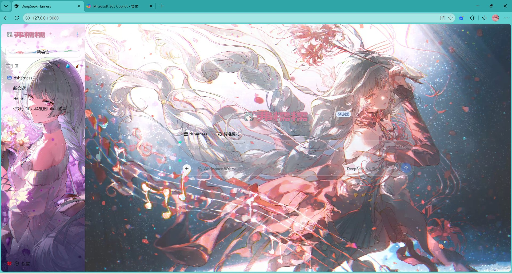
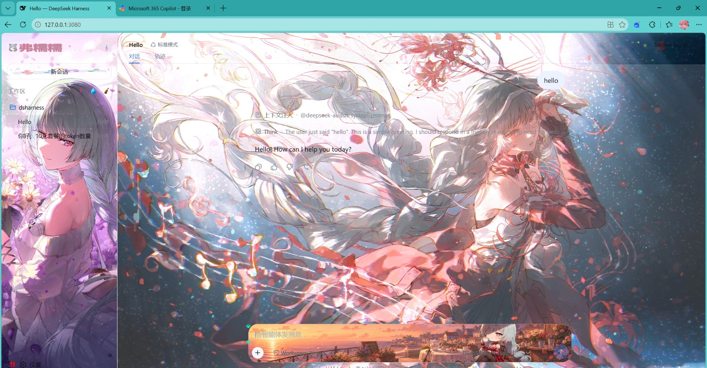

# @luvian/dsh-ui-wallpaper

DeepSeek Harness Web UI 的客户端皮肤插件（品牌：弗糯糯 / nuonuo）。给侧栏、中区、输入卡、主页标题、聊天区换肤，中区循环播放静音视频壁纸。

> 这是给《汐薯小馆》作者霄用的个人皮肤插件，由 GPT 初版、WorkBuddy（渡）重构硬化。

## 预览

> 截图里的壁纸/图标是作者个人审美（build 阶段用 `theme.config.local.json` 注入，作者私密），仓库里不带这些素材 —— 其他人装上后看到的会是骨架皮肤 + 占位，需要自己塞素材。

| 主页（hero） | 聊天（active） |
| :---: | :---: |
|  |  |

## 兼容性

- **目标 Harness 版本**：`0.1.0-rc.5`（本插件基于该版本源码的 DOM 契约与主题 API 实现）。
- **稳定的官方契约（插件依赖这些，不会随构建变）**：
  - `data-slot="conversation"` / `data-slot="sidebar"` 等 —— Harness 的插槽接缝（scoped-slots）。
  - `data-phase`（hero / active / settling / inert）—— 会话阶段标识。
  - `data-conversation-scroll` / `data-composer-card` / `data-composer-seat` —— 官方 `data-*` 契约。
  - `ctx.theme.overrideTokens(source, tokens)` —— 来自 `@deepseek-ai/dsh-client-ui-theme` 的主题令牌 API。
- **脆弱点（已尽量降级为兜底）**：侧栏按钮图标原靠 SVG `d` 路径几何匹配，现主定位改为 `data-slot` 容器 + 中英文案归一，几何匹配仅作最后兜底。若 Harness 大改侧栏 DOM，需重新核对这里。

## 安装

```sh
# 方式一：从 GitHub 直接装（推荐，始终拿到最新源码）
dsh plugin --profile web add "github:EnernityLune/dsh-luvian-ui-wallpaper#main"

# 方式二：从 npm 装（需先 npm publish）
dsh plugin --profile web add @luvian/dsh-ui-wallpaper

# 装完重启 dsh web 并刷新页面
```

> ⚠️ 本插件**不带主题素材**（壁纸视频 / 图标是作者私人的，遵循你自己的审美）。装上后你会得到一套透明玻璃质感的骨架皮肤，**但没有壁纸**。要用自己的素材，见下。

## 用自己的素材（换肤）

```sh
# 1. 把你的壁纸视频 / 图标放进 src/client/assets/（或在 theme.config.json 里改路径指向本地文件）
# 2. 仅检查素材是否齐全：
pnpm assets:check
# 3. 一键生成素材接入 + 打包：
pnpm bundle
# 4. 重新挂到本地 Harness 验证：
dsh plugin --profile web add "link:$(pwd)"
```

## 开发（源码构建）

```sh
# 改素材：只编辑 theme.config.json 里的 assets 路径（不碰 TS）
pnpm assets:check
pnpm bundle
```

构建产物在 `lib/client.js`，由 `cordis.patch.yml`（id `luvian-wallpaper`）随 Harness 启动自动加载。运行时控制台会打印 `🔥 Luvian theme loaded, nuonuo`。

## 发布（作者）

本插件**刻意不带私人素材**，发布出去的是 no-asset 骨架版。发布前务必确认 `lib/` 是 no-asset 构建（包体积应 < 1MB，而非内联素材后的几十 MB）。

```sh
# 1. 临时移走本地私人素材配置，确保走占位/空视频
mv theme.config.local.json theme.config.local.json.bak
# 2. 重新构建（生成 no-asset 的 lib/）
pnpm bundle
# 3. 登录 npm（首次需先 npm adduser / npm login）
npm login
# 4. 发布（dry-run 先确认体积，再真发）
npm publish --dry-run
npm publish
# 5. 发布完恢复本地素材配置，开发照旧
mv theme.config.local.json.bak theme.config.local.json
```

> ⚠️ 千万不要在 `theme.config.local.json` 存在的情况下直接 `npm publish`——那样私人壁纸/图标会被内联进 `lib/` 一起发出去。`.npmignore` 已屏蔽 `src/client/assets/`，但 `lib/` 里的内联素材不受其管控，所以第 1 步的移走动作是关键保险。
>
> GitHub 仓库（带 `dsh-plugin` topic）已是 dsh 社区的主要分发方式；npm 为可选二级分发。

## 素材降级

- 视频缺失 → 中区只无视频壁纸，不崩。
- 图片缺失 → 自动用 1×1 透明占位兜底，不崩。

## 目录

```
src/
  index.ts                 宿主加载入口（空壳，逻辑全在 client）
  client/
    index.ts               插件注册点，挂各 applyX 并管理卸载
    dom.ts                 waitForElement / applyInlineStyles / replaceSvgWithImage
    theme/
      config.ts            视觉参数 + tokenOverrides（集中配置）
      generated.ts         由 build-theme.mjs 自动生成（勿手改）
    components/            每界面区域一个 applyX
scripts/build-theme.mjs    读 theme.config.json → 生成 generated.ts
theme.config.json          用户唯一要改的文件（换图换视频）
```
